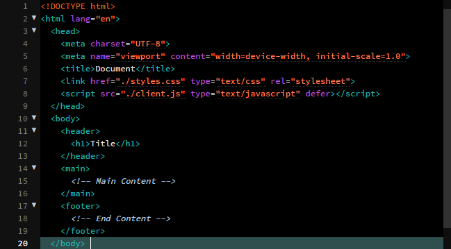
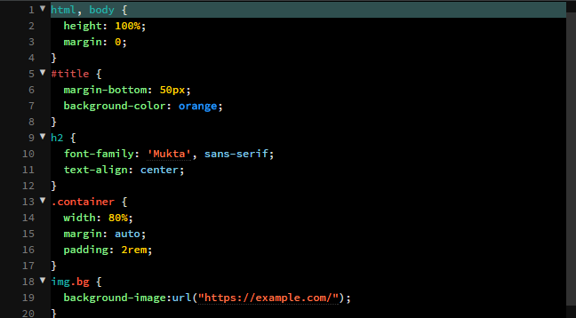
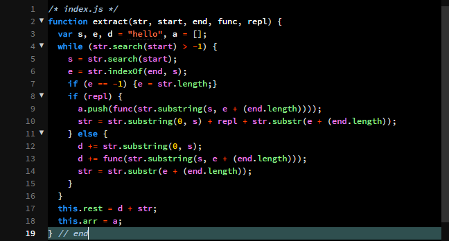

Dark Theme for Brackets
==============================

To use, go to Brackets' Extension Manager(EM) and either:
- search by name and install,
- use this github url and paste to EM link,
- or upload manually with this repo's zip file.

---

## HTML

## CSS

## JS

